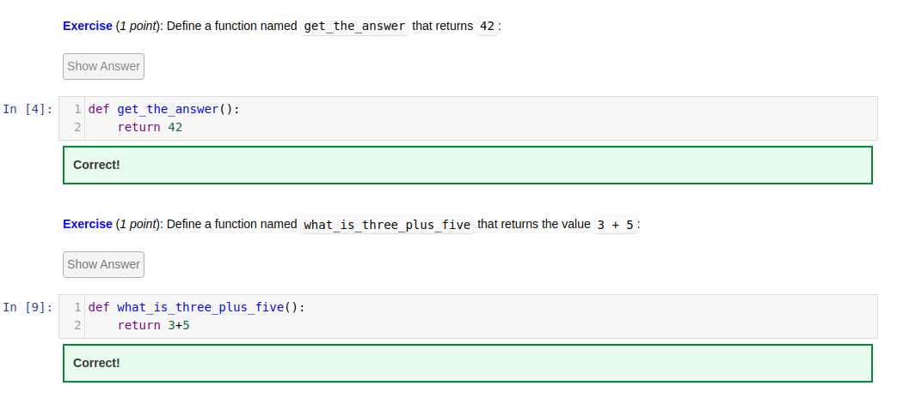
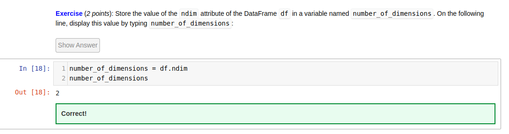

# gemba23-marketing
GEMBA 23 Marketing Python Solutions

## Basic level

<details>

### 5 - Creating your own function



### 6 - Lists


### 7 - Loops
[loops-exercise1.py](https://github.com/mremini/gemba23-marketing/blob/main/Python/loops-exercise1.py)

```
def length_of_longest_word(word_list):
    max_length = 0
    for word in word_list:
        if len(word) > max_length:
            max_length = len(word)
    return max_length

```

[loops-exercise2.py](https://github.com/mremini/gemba23-marketing/blob/main/Python/loops-exercise2.py)

```
def sum_leq(num):
	somme=0
	for in in range(1,num+1)
		somme=somme+in
	return somme

s= sum_leq(100)
s

```


### 8 - FunctionsII Advanced Topics

### 9 - Boolean Logic


[bool-exercise1.py](https://github.com/mremini/gemba23-marketing/blob/main/Python/bool-exercise1.py)


```
def get_loyalty_program(customer_spending_usd):
    status = "no status"
    if customer_spending_usd > 20000 and customer_spending_usd < 50000:
        status="gold"
    elif customer_spending_usd > 50000:
        status="platinum"
    else:
        status = "no status"
    return status
```

[bool-exercise2.py](https://github.com/mremini/gemba23-marketing/blob/main/Python/bool-exercise2.py)


```
def should_get_hired(interview_one_score, interview_two_score):
    if interview_one_score > 4 and interview_two_score > 4:
        action = 'hire'
    elif interview_one_score > 4 or interview_two_score > 4:
        action = 'interview again'
    else:
        action = 'nope'
        return action
```

</details>

## Intermediate level

<details>

### 1 - Loading Data into Python




[loaddata-exercise2.py](https://github.com/mremini/gemba23-marketing/blob/main/Python/loaddata-exercise2.py)


```
sales_q2=df.get('Sales Q2 2019 (USD)')
sales_q2

```

[loaddata-exercise3.py](https://github.com/mremini/gemba23-marketing/blob/main/Python/loaddata-exercise3.py)


```
df['sales_q1_in_thousands'] = df["Sales Q1 2019 (USD)"] / 1000
df.head()

```


### 2 - Matlolib

[visualisedata-exercise1.py](https://github.com/mremini/gemba23-marketing/blob/main/Python/visualisedata-exercise1.py)

```
annual_income_usd = [100000, 130000, 40000, 50000, 120000, 48000, 50000,78000, 150000]
age_yrs = [60, 24, 32, 36, 28, 36, 32, 60, 68]
plt.scatter(age_yrs, annual_income_usd, marker="p", c="g")
plt.xlabel("Age (yrs)")
plt.ylabel("Annual Income (USD)")
plt.title("Annual Income vs. Age")

```

[visualisedata-exercise2.py](https://github.com/mremini/gemba23-marketing/blob/main/Python/visualisedata-exercise2.py)

```
churn_df = pd.read_csv("data/employee-churn.csv")
plt.scatter(churn_df['gpa'], churn_df['aptitude.score'], marker="*")
plt.show()
```

### 3 - The numpy Module

[numpy-exercise1.py](https://github.com/mremini/gemba23-marketing/blob/main/Python/numpy-exercise1.py)

```
def count_zeros(my_array):
    nbr_zero=0
    for row in my_array:
        for cell in row:
            if cell==0:
               nbr_zero=nbr_zero+1
    return nbr_zero
```


[numpy-exercise2.py](https://github.com/mremini/gemba23-marketing/blob/main/Python/numpy-exercise2.py)

```
def shaped_range(start, end, n_rows, n_cols):
        range_arr = np.arange(start, end, 1)
        reshaped_arr = range_arr.reshape(n_rows, n_cols)
        return reshaped_arr
```

### 4 - Principal Component Analysis

[pca-exec1.py](https://github.com/mremini/gemba23-marketing/blob/main/Python/pca-exec1.py)

```
stock_pca = PCA()
stock_pca.fit(stock_df)
stock_n_important_components = 3
stock_important_components = stock_pca.components_[0:stock_n_important_components,:]
stock_final_components = varimax_rotation(stock_important_components)
stock_final_components_df = pd.DataFrame(stock_final_components, columns=stock_df.columns)
stock_final_components_df
```

### 5 - Multi Dimension SCaling

[MDS-exec1.py](https://github.com/mremini/gemba23-marketing/blob/main/Python/MDS-exec1.py)

```
cookies_models = [
    'Prince',
    'Oreo',
    'Choco Bueno',
    'Petit Ecolier',
    'Mikado',
    'Granola',
    'Kinder',
    'Sables'
]
my_dissimilarity_matrix = np.array([
    [0, 5, 8, 4, 5, 3, 8, 5],
    [5, 0, 1, 5, 4, 7, 8, 3],
    [8, 1, 0, 4, 4, 3, 3, 4],
    [4, 5, 4, 0, 2, 5, 9, 8],
    [5, 4, 4, 2, 0, 5, 3, 7],
    [3, 7, 3, 5, 5, 0, 1, 9],
    [8, 8, 3, 9, 3, 1, 0, 8],
    [5, 3, 4, 8, 7, 9, 8, 0]
])
mds = MDS(dissimilarity="precomputed",random_state=63)
my_perceptual_map = mds.fit_transform(my_dissimilarity_matrix)
x = my_perceptual_map[:,0]
y = my_perceptual_map[:,1]
plt.scatter(x, y)
for i in range(0, len(cookies_models)):
    txt = cookies_models[i]
    plt.annotate(txt, [x[i], y[i]])
plt.show()
```

### 6 - Cluster analysis

[clusteranalysis-exec1.py](https://github.com/mremini/gemba23-marketing/blob/main/Python/clusteranalysis-exec1.py)

```
import numpy as np
inertia_values = []
all_k = np.arange(1,7)
for k in all_k:
    kmeans = KMeans(n_clusters=k, random_state=0)
    kmeans.fit(points_scaled)
    inertia_values.append(kmeans.inertia_)
plt.plot(all_k, inertia_values)
plt.show()
optimal_k = 4
```


[clusteranalysis-exec2.py](https://github.com/mremini/gemba23-marketing/blob/main/Python/clusteranalysis-exec2.py)

```
optimal_clusters = KMeans(n_clusters=4, random_state=0)
labels = optimal_clusters.fit_predict(points_scaled)
plot_clusters(points_scaled, labels, optimal_clusters.cluster_centers_)
```

### 7 - Linear Regression

### 8 - Logistic Regression

### 9 - Metrics: EValuating Model Accuracy

</details>


## Advanced level

<details>

### 1 - Neural Netwroks

### 2 - Building and Training Neural Networks

### 3 - Training Neural Networks

### 4 - Overfitting

### 5 - Applying Neural Networks to Business Problems

### 6 - Transfer Learning - Standing on the shoulders of Giants

</details>